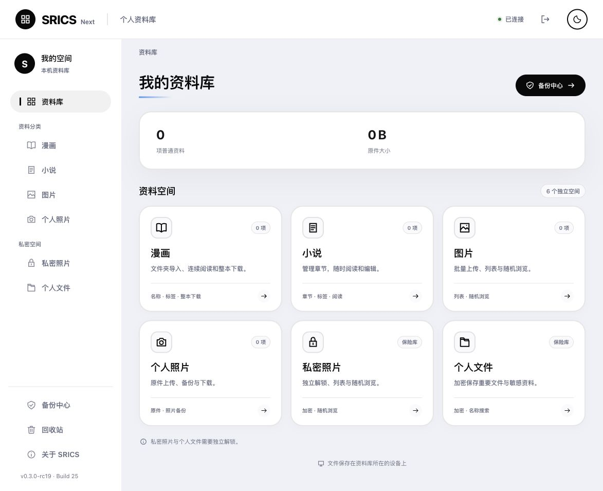

# SRICS Next

用于局域网的个人资料库：管理漫画、小说、Markdown 文档、图片、个人照片、私密照片与个人文件。

Self-hosted personal library with private storage, encrypted backups, and disaster recovery.

**当前版本：v0.3.0-rc20 · Build 26，公开测试版。Apple Silicon Mac，macOS 27.0 或更新版本。**

项目原创代码、文档和应用图标使用 [AGPL-3.0-only](LICENSE)。第三方组件保留各自许可，见 [第三方声明](THIRD_PARTY_NOTICES.md)。许可证不改变用户资料的归属。发布修改版或通过网络提供修改版时，应按 AGPL 提供相应源码。



## 开始使用

1. 把 `SRICS Next.app` 放入“应用程序”，打开后选择资料目录。
2. 在“密码与保险库”设置登录密码；需要私密空间时另设保险库口令。
3. 点击“保存并启动”，再打开资料库。默认仅本机访问；局域网访问需配置 HTTPS 和访问设备的证书信任。
4. 在 App → 备份完成分步设置，创建并校验第一份备份，然后开启每天自动备份。

网页用于浏览、上传、编辑和下载；App 用于密码、网络、资料目录、备份、迁移与更新设置。关闭 App 窗口后，后台服务继续运行。修改设置前先停止服务。

完整操作见 [安装与使用](docs/TRIAL_INSTALL.md)，备份及换设备见 [统一备份与恢复](docs/RECOVERY_KEY.md)。

## 密码、备份与恢复

| 项目 | 用途 |
| --- | --- |
| 登录密码 | 进入网页资料库 |
| 保险库口令 | 日常解锁私密照片与个人文件 |
| 恢复 JSON | 单独离线保管，用于从备份恢复全部资料，不用于日常改密 |
| `.sricsbackup` 文件 | 同一种完整加密备份，可保存到独立硬盘、网盘同步目录或 S3 |

每个资料库只需一份新版恢复 JSON；改密、启用私密空间和更换备份位置继续使用原文件。完整、未损坏的备份与匹配 JSON 可在原机和日常密码丢失后恢复普通与私密原文件，只能恢复已经备份的内容。备份口令与云端凭据由程序内部管理，无需准备口令文件或凭据 JSON。

所有日期备份保留，不自动删除；完整包需要额外空间。网盘同步目录的文件需等待同步完成。旧备份继续使用对应旧 JSON，兼容入口保留。

## 七类资料

| 模块 | 操作 |
| --- | --- |
| 漫画 | 文件夹导入、名称与标签搜索、第一页预览、连续阅读、整本 ZIP 下载 |
| 小说 | 名称与标签搜索、章节编辑 / 增删 / 排序、阅读、TXT 下载 |
| 文档 | 新建 / 编辑 Markdown、名称与标签搜索、预览与阅读、MD 原文下载 |
| 图片 | 批量上传下载、列表与随机浏览 |
| 个人照片 | 原文件上传、列表、原件下载 |
| 私密照片 | 独立解锁、加密上传下载、列表与随机浏览 |
| 个人文件 | 加密保存、名称搜索、改名、下载与删除 |

漫画中的已有 WebP 原样保存，支持的非 WebP 图片无损转换；普通图片、个人照片、私密照片与个人文件保留原始字节。文件分类和校验说明见 [存储与保真](docs/STORAGE_PRESERVATION.md)。

## 更新与部署验收

更新前在 App → 版本与更新点击“停止服务并准备更新”，完成备份后退出并替换 `.app`。程序、资料与配置分开保存，替换 App 不覆盖资料。

当前包是本机临时签名，尚未完成 Developer ID 公证。正式作为主资料库前，在目标 Mac 和真实备份位置完成恢复验收；协议测试不替代真实云账号、另一台机器和 100 GB 资料量的验证。见 [验收清单](docs/ACCEPTANCE.md) 与 [更新记录](CHANGELOG.md)。

## 开发与维护

运行结构是 Go 服务、Vue 网页、SQLite 和本地文件，App 随附 cwebp / restic，运行时无需 Go、Node.js 或 Homebrew。

源码构建需 Go 1.27.1（或支持下载该工具链的 Go）、Node.js 22.12+ 或 24+、Python 3.9+；macOS App 打包需完整 Xcode 27+，包含 Icon Composer 和 actool：

```sh
brew install webp
./scripts/build.sh
./scripts/check.sh
bash scripts/check-security.sh
./scripts/package-macos.sh --skip-build
```

日常开发使用 `develop`，`main` 保留验收版本。GitHub Actions 仅手动触发，普通推送和 PR 不消耗构建额度。维护者通过 GitHub Desktop 推送，可直接交付未压缩 App。

每次构建自动附上当前源文件、构建脚本、依赖版本记录及许可证；网页登录页、关于页和 App → 版本与更新提供源码入口。源码包仅包含项目文件，不包含资料目录、配置、密码或恢复 JSON。构建后的源文件变动会使打包校验失败，需重新构建。

问题反馈和代码贡献见 [CONTRIBUTING.md](CONTRIBUTING.md)，安全问题请按 [SECURITY.md](SECURITY.md) 私下报告。目前未验收其他操作系统、公网或多用户部署。

版本与构建号的唯一来源是 [release.json](internal/buildinfo/release.json)。维护和打包规则见 [版本约定](docs/VERSIONING.md)，后台管理见 [本机程序](docs/LOCAL_LAUNCHER.md)，构建约定见 [构建说明](docs/BUILD_WORKFLOW.md)。真实资料、配置、数据库、密码、凭据、恢复 JSON 与备份不得提交到仓库。

<details>
<summary>历史设计与检查记录</summary>

以下按当时版本记录，不作为当前操作指南：

- [初始需求](docs/FEATURES.md)、[开发计划](docs/DEVELOPMENT_PLAN.md)、[界面约定](docs/INTERFACE.md)
- [基础验证](docs/M0_FOUNDATION.md)、[普通资料](docs/M1_M2_LIBRARY.md)、[小说](docs/M3_NOVELS.md)、[私密空间](docs/M4_PRIVATE.md)
- [旧版部署](docs/M5_DEPLOYMENT.md)、[旧版云端备份](docs/M5_CLOUD_BACKUP.md)、[旧版恢复](docs/M5_RECOVERY.md)、[旧版恢复 JSON](docs/RECOVERY_KEY_LEGACY.md)
- [最初收尾](docs/RELEASE_READINESS.md)、[安全检查](docs/SECURITY_2026-09-28.md)、[安全复查](docs/SECURITY_RECHECK_2026-09-28.md)、[恢复检查](docs/SECURITY_RECOVERY_2026-09-28.md)、[失败保护](docs/SECURITY_FAILURES_2026-09-28.md)
- [统一备份实施记录](docs/BACKUP_UNIFICATION.md)

</details>
